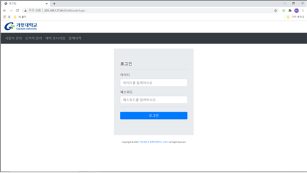
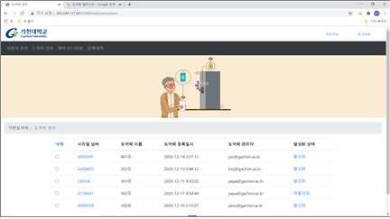
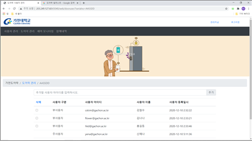

# 관리자 모니터링 웹
- [관리자 로그인](login.ejs), [관리자 정보변경](mod.ejs)
- [사용자 관리](adminuser.ejs): 사용자 삭제
- [도어락 관리](admindoor.ejs): 도어락 삭제, 도어락 활성화, 도어락 비활성화
- [도어락 사용자 관리](adminuser.ejs): 도어락 사용자 추가, 도어락 사용자 삭제
- [제어 모니터링](controllog.ejs), [장애 모니터링](errorapp.ejs)

### 구현 화면
|||
|:---:|:---:|
|||
|로그인 화면||
|||
|도어락 관리 화면|도어락 사용자 관리 화면|